# JobIntel - Class Diagram

This document contains the comprehensive class diagram for the JobIntel Recruitment Platform.

## Full System Class Diagram

```mermaid
classDiagram
    direction TB

    %% ==================== ENUMERATIONS ====================
    class AccountType {
        <<enumeration>>
        JobSeeker
        Recruiter
    }

    class AuthProvider {
        <<enumeration>>
        Email
        Google
    }

    class AssessmentStatus {
        <<enumeration>>
        InProgress
        Completed
        Abandoned
        Expired
    }

    class JobTitleRoleFamily {
        <<enumeration>>
        Frontend
        Backend
        FullStack
        Mobile
        Data
        DevOps
        QA
        Design
        Other
    }

    class EmploymentType {
        <<enumeration>>
        FullTime
        PartTime
        Freelance
        Internship
    }

    class QuestionCategory {
        <<enumeration>>
        Technical
        SoftSkill
    }

    class QuestionDifficulty {
        <<enumeration>>
        Easy
        Medium
        Hard
    }

    class LanguageProficiency {
        <<enumeration>>
        Beginner
        Intermediate
        Advanced
        Native
    }

    class ExperienceSeniorityLevel {
        <<enumeration>>
        Junior
        Mid
        Senior
    }

    %% ==================== IDENTITY MODULE ====================
    class User {
        +int Id
        +string FirstName
        +string LastName
        +string Email
        +string? PasswordHash
        +AuthProvider AuthProvider
        +string? ProviderUserId
        +string? ProfilePictureUrl
        +AccountType AccountType
        +bool IsEmailVerified
        +bool IsActive
        +DateTime CreatedAt
        +DateTime UpdatedAt
        +int FailedLoginAttempts
        +DateTime? LastFailedLoginAt
        +DateTime? LockoutEnd
        +string? LockoutReason
        +DateTime? LastSuccessfulLoginAt
        +int ProfileCompletionStep
    }

    class EmailVerification {
        +int Id
        +int UserId
        +string VerificationCode
        +DateTime CreatedAt
        +DateTime ExpiresAt
        +bool IsUsed
    }

    class PasswordReset {
        +int Id
        +int UserId
        +string Token
        +DateTime CreatedAt
        +DateTime ExpiresAt
        +bool IsUsed
    }

    %% ==================== JOBSEEKER MODULE ====================
    class JobSeeker {
        +int Id
        +int UserId
        +int? JobTitleId
        +int? YearsOfExperience
        +int? CountryId
        +string? City
        +string? PhoneNumber
        +int? FirstLanguageId
        +LanguageProficiency? FirstLanguageProficiency
        +int? SecondLanguageId
        +LanguageProficiency? SecondLanguageProficiency
        +string? Bio
        +DateTime CreatedAt
        +DateTime UpdatedAt
        +decimal? CurrentAssessmentScore
        +DateTime? LastAssessmentDate
        +int? AssessmentJobTitleId
    }

    class Recruiter {
        +int Id
        +int UserId
        +string CompanyName
        +string CompanySize
        +string Industry
        +string Location
        +string? Website
        +string? LinkedIn
        +string? CompanyDescription
        +string? LogoUrl
        +DateTime CreatedAt
        +DateTime UpdatedAt
    }

    class Experience {
        +int Id
        +int JobSeekerId
        +string JobTitle
        +string CompanyName
        +string? Location
        +EmploymentType EmploymentType
        +DateTime StartDate
        +DateTime? EndDate
        +bool IsCurrent
        +string? Responsibilities
        +int DisplayOrder
        +DateTime CreatedAt
        +DateTime UpdatedAt
        +bool IsDeleted
        +DateTime? DeletedAt
    }

    class Education {
        +int Id
        +int JobSeekerId
        +string Institution
        +string Degree
        +string Major
        +string? GradeOrGPA
        +DateTime StartDate
        +DateTime? EndDate
        +bool IsCurrent
        +int DisplayOrder
        +DateTime CreatedAt
        +DateTime UpdatedAt
        +bool IsDeleted
        +DateTime? DeletedAt
    }

    class Project {
        +int Id
        +int JobSeekerId
        +string Title
        +string? TechnologiesUsed
        +string? Description
        +string? ProjectLink
        +int DisplayOrder
        +bool IsDeleted
        +DateTime? DeletedAt
        +DateTime CreatedAt
        +DateTime UpdatedAt
    }

    class Resume {
        +int Id
        +int JobSeekerId
        +string FileName
        +string StoredFileName
        +string FilePath
        +string ContentType
        +long FileSizeBytes
        +string ParseStatus
        +string? ParsedContent
        +DateTime CreatedAt
        +DateTime UpdatedAt
        +bool IsDeleted
    }

    class SocialAccount {
        +int Id
        +int JobSeekerId
        +string? LinkedIn
        +string? Github
        +string? Behance
        +string? Dribbble
        +string? PersonalWebsite
        +DateTime CreatedAt
        +DateTime UpdatedAt
    }

    class JobSeekerSkill {
        +int Id
        +int JobSeekerId
        +int SkillId
        +string Source
    }

    %% ==================== ASSESSMENT MODULE ====================
    class AssessmentAttempt {
        +int Id
        +int JobSeekerId
        +int JobTitleId
        +decimal? OverallScore
        +decimal? TechnicalScore
        +decimal? SoftSkillsScore
        +AssessmentStatus Status
        +DateTime StartedAt
        +DateTime? CompletedAt
        +int TimeLimitMinutes
        +int TotalQuestions
        +int QuestionsAnswered
        +DateTime ExpiresAt
        +DateTime? ScoreExpiresAt
        +bool IsActive
    }

    class AssessmentQuestion {
        +int Id
        +string QuestionText
        +QuestionCategory Category
        +JobTitleRoleFamily RoleFamily
        +int? SkillId
        +QuestionDifficulty Difficulty
        +ExperienceSeniorityLevel SeniorityLevel
        +string Options
        +int CorrectAnswerIndex
        +int? TimePerQuestion
        +bool IsActive
        +DateTime CreatedAt
        +DateTime UpdatedAt
        +string? Explanation
    }

    class AssessmentAnswer {
        +int Id
        +int AssessmentAttemptId
        +int QuestionId
        +int SelectedAnswerIndex
        +bool IsCorrect
        +int TimeSpentSeconds
        +DateTime AnsweredAt
    }

    %% ==================== REFERENCE / JOB MODULE ====================
    class Job {
        +int Id
        +int RecruiterId
        +string Title
        +string Description
        +string Requirements
        +string? EmploymentType
        +int MinYearsOfExperience
        +string? Location
        +DateTime PostedAt
        +DateTime UpdatedAt
        +bool IsActive
    }

    class JobSkill {
        +int Id
        +int JobId
        +int SkillId
    }

    class Recommendation {
        +int Id
        +int JobId
        +int JobSeekerId
        +decimal MatchScore
        +DateTime GeneratedAt
    }

    class Skill {
        +int Id
        +string Name
        +DateTime CreatedAt
    }

    class JobTitle {
        +int Id
        +string Title
        +string? Category
        +JobTitleRoleFamily RoleFamily
        +bool IsActive
        +DateTime CreatedAt
    }

    class Country {
        +int Id
        +string IsoCode
        +string NameEn
        +string NameAr
        +string? PhoneCode
        +bool IsActive
        +int SortOrder
        +DateTime CreatedAt
    }

    class Language {
        +int Id
        +string IsoCode
        +string NameEn
        +string NameAr
        +bool IsActive
        +int SortOrder
        +DateTime CreatedAt
    }

    %% ==================== SERVICES (Business Logic Layer) ====================
    class IAuthService {
        <<interface>>
        +RegisterAsync(RegisterDto) Task~AuthResponseDto~
        +LoginAsync(LoginDto) Task~AuthResponseDto~
        +GoogleAuthAsync(GoogleAuthDto) Task~AuthResponseDto~
        +VerifyGoogleTokenAsync(idToken) Task~GoogleUserInfo~
        +VerifyEmailAsync(EmailVerificationDto) Task~AuthResponseDto~
        +ResendVerificationCodeAsync(ResendVerificationDto) Task~AuthResponseDto~
        +ForgotPasswordAsync(ForgotPasswordDto) Task~AuthResponseDto~
        +ValidateResetTokenAsync(ValidateResetTokenDto) Task~AuthResponseDto~
        +ResetPasswordAsync(ResetPasswordDto) Task~AuthResponseDto~
        +GenerateJwtToken(User) string
        +HashPassword(password) string
        +VerifyPassword(password, hash) bool
    }

    class AuthService {
        -AppDbContext _context
        -IEmailService _emailService
        -ITokenService _tokenService
        -ILogger _logger
        -IConfiguration _configuration
        +RegisterAsync(RegisterDto) Task~AuthResponseDto~
        +LoginAsync(LoginDto) Task~AuthResponseDto~
        +GoogleAuthAsync(GoogleAuthDto) Task~AuthResponseDto~
        +VerifyGoogleTokenAsync(idToken) Task~GoogleUserInfo~
        -NormalizeEmail(email) string
        -ConstantTimeEquals(a, b) bool
    }

    class IEmailService {
        <<interface>>
        +SendVerificationEmailAsync(email, firstName, code) Task~bool~
        +SendWelcomeEmailAsync(email, firstName) Task~bool~
        +SendPasswordResetLinkAsync(email, firstName, token) Task~bool~
        +SendAccountLockedEmailAsync(email, firstName, lockoutEnd) Task~bool~
        +GenerateVerificationCode() string
        +GenerateSecureToken() string
    }

    class EmailService {
        -ILogger _logger
        -EmailSettings _emailSettings
        +SendVerificationEmailAsync(email, firstName, code) Task~bool~
        +SendWelcomeEmailAsync(email, firstName) Task~bool~
        +SendPasswordResetLinkAsync(email, firstName, token) Task~bool~
        +SendAccountLockedEmailAsync(email, firstName, lockoutEnd) Task~bool~
    }

    class ITokenService {
        <<interface>>
        +GenerateJwtToken(User) string
        +GeneratePasswordResetToken(email, userId, resetId) string
        +ValidatePasswordResetToken(token) tuple
    }

    class TokenService {
        -JwtSettings _jwtSettings
        +GenerateJwtToken(User) string
        +GeneratePasswordResetToken(email, userId, resetId) string
        +ValidatePasswordResetToken(token) tuple
    }

    class IProfileService {
        <<interface>>
        +GetProfileAsync(userId) Task~ProfileDto~
        +UpdateProfileAsync(userId, UpdateProfileDto) Task~ProfileDto~
        +GetProfileCompletionAsync(userId) Task~ProfileCompletionDto~
    }

    class ProfileService {
        -AppDbContext _context
        -ILogger _logger
        +GetProfileAsync(userId) Task~ProfileDto~
        +UpdateProfileAsync(userId, UpdateProfileDto) Task~ProfileDto~
    }

    class IResumeService {
        <<interface>>
        +UploadResumeAsync(userId, file) Task~ResumeDto~
        +GetResumeAsync(userId) Task~ResumeDto~
        +DeleteResumeAsync(userId) Task~bool~
        +DownloadResumeAsync(userId) Task~FileStreamResult~
    }

    class ResumeService {
        -AppDbContext _context
        -FileStorageSettings _settings
        -ILogger _logger
    }

    class IExperienceService {
        <<interface>>
        +GetExperiencesAsync(userId) Task~List~ExperienceDto~~
        +AddExperienceAsync(userId, CreateExperienceDto) Task~ExperienceDto~
        +UpdateExperienceAsync(userId, id, UpdateExperienceDto) Task~ExperienceDto~
        +DeleteExperienceAsync(userId, id) Task~bool~
        +ReorderExperiencesAsync(userId, List~int~) Task~bool~
    }

    class ExperienceService {
        -AppDbContext _context
        -ILogger _logger
    }

    class IEducationService {
        <<interface>>
        +GetEducationsAsync(userId) Task~List~EducationDto~~
        +AddEducationAsync(userId, CreateEducationDto) Task~EducationDto~
        +UpdateEducationAsync(userId, id, UpdateEducationDto) Task~EducationDto~
        +DeleteEducationAsync(userId, id) Task~bool~
    }

    class EducationService {
        -AppDbContext _context
        -ILogger _logger
    }

    class IProjectService {
        <<interface>>
        +GetProjectsAsync(userId) Task~List~ProjectDto~~
        +AddProjectAsync(userId, CreateProjectDto) Task~ProjectDto~
        +UpdateProjectAsync(userId, id, UpdateProjectDto) Task~ProjectDto~
        +DeleteProjectAsync(userId, id) Task~bool~
    }

    class ProjectService {
        -AppDbContext _context
        -ILogger _logger
    }

    %% ==================== FUTURE/PREDICTED SERVICES ====================
    class IAssessmentService {
        <<interface>>
        +StartAssessmentAsync(jobSeekerId) Task~AssessmentAttemptDto~
        +GetNextQuestionAsync(attemptId) Task~QuestionDto~
        +SubmitAnswerAsync(attemptId, AnswerDto) Task~AnswerResultDto~
        +CompleteAssessmentAsync(attemptId) Task~AssessmentResultDto~
        +GetAssessmentHistoryAsync(jobSeekerId) Task~List~AssessmentAttemptDto~~
        +CanTakeAssessmentAsync(jobSeekerId) Task~bool~
    }

    class AssessmentService {
        <<future>>
        -AppDbContext _context
        -ILogger _logger
        -CalculateOverallScore(attempt) decimal
        -SelectQuestionsForAttempt(jobSeekerId, roleFamily) List~AssessmentQuestion~
    }

    class IMatchingService {
        <<interface>>
        +GenerateRecommendationsAsync(jobId) Task~List~RecommendationDto~~
        +GetJobRecommendationsAsync(jobSeekerId) Task~List~JobRecommendationDto~~
        +CalculateMatchScoreAsync(jobSeekerId, jobId) Task~decimal~
    }

    class MatchingService {
        <<future>>
        -AppDbContext _context
        -ILogger _logger
        -CalculateSkillMatchScore(jobSeekerSkills, jobSkills) decimal
        -CalculateExperienceScore(yearsOfExp, minRequired) decimal
        -ApplyAssessmentBoost(baseScore, assessmentScore) decimal
    }

    class IJobService {
        <<interface>>
        +CreateJobAsync(recruiterId, CreateJobDto) Task~JobDto~
        +UpdateJobAsync(recruiterId, jobId, UpdateJobDto) Task~JobDto~
        +GetJobAsync(jobId) Task~JobDto~
        +GetRecruiterJobsAsync(recruiterId) Task~List~JobDto~~
        +SearchJobsAsync(SearchJobDto) Task~PagedResult~JobDto~~
        +DeactivateJobAsync(recruiterId, jobId) Task~bool~
    }

    class JobService {
        <<future>>
        -AppDbContext _context
        -ILogger _logger
    }

    class ICVParserService {
        <<interface>>
        +ParseResumeAsync(filePath) Task~ParsedCVDto~
        +ExtractSkillsAsync(content) Task~List~string~~
        +ExtractExperienceAsync(content) Task~List~ExperienceDto~~
    }

    class CVParserService {
        <<future>>
        -HttpClient _httpClient
        -string _nlpServiceUrl
        +ParseResumeAsync(filePath) Task~ParsedCVDto~
    }

    %% ==================== CONTROLLERS (Presentation Layer) ====================
    class AuthController {
        -IAuthService _authService
        -ILogger _logger
        +Register(RegisterDto) Task~ActionResult~
        +Login(LoginDto) Task~ActionResult~
        +GoogleAuth(GoogleAuthDto) Task~ActionResult~
        +VerifyEmail(EmailVerificationDto) Task~ActionResult~
        +ResendVerification(ResendVerificationDto) Task~ActionResult~
        +ForgotPassword(ForgotPasswordDto) Task~ActionResult~
        +ValidateResetToken(ValidateResetTokenDto) Task~ActionResult~
        +ResetPassword(ResetPasswordDto) Task~ActionResult~
    }

    class ProfileController {
        -IProfileService _profileService
        -ILogger _logger
        +GetProfile() Task~ActionResult~
        +UpdateProfile(UpdateProfileDto) Task~ActionResult~
        +GetProfileCompletion() Task~ActionResult~
    }

    class ResumeController {
        -IResumeService _resumeService
        -ILogger _logger
        +UploadResume(IFormFile) Task~ActionResult~
        +GetResume() Task~ActionResult~
        +DownloadResume() Task~ActionResult~
        +DeleteResume() Task~ActionResult~
    }

    class ExperienceController {
        -IExperienceService _experienceService
        -ILogger _logger
        +GetExperiences() Task~ActionResult~
        +AddExperience(CreateExperienceDto) Task~ActionResult~
        +UpdateExperience(id, UpdateExperienceDto) Task~ActionResult~
        +DeleteExperience(id) Task~ActionResult~
    }

    class EducationController {
        -IEducationService _educationService
        -ILogger _logger
        +GetEducations() Task~ActionResult~
        +AddEducation(CreateEducationDto) Task~ActionResult~
        +UpdateEducation(id, UpdateEducationDto) Task~ActionResult~
        +DeleteEducation(id) Task~ActionResult~
    }

    class ProjectsController {
        -IProjectService _projectService
        -ILogger _logger
        +GetProjects() Task~ActionResult~
        +AddProject(CreateProjectDto) Task~ActionResult~
        +UpdateProject(id, UpdateProjectDto) Task~ActionResult~
        +DeleteProject(id) Task~ActionResult~
    }

    class LocationsController {
        -AppDbContext _context
        +GetCountries() Task~ActionResult~
        +GetLanguages() Task~ActionResult~
        +GetJobTitles() Task~ActionResult~
    }

    class SocialAccountsController {
        -ISocialAccountService _socialAccountService
        -ILogger _logger
        +GetSocialAccounts() Task~ActionResult~
        +UpdateSocialAccounts(UpdateSocialAccountsDto) Task~ActionResult~
    }

    %% ==================== FUTURE CONTROLLERS ====================
    class AssessmentController {
        <<future>>
        -IAssessmentService _assessmentService
        +StartAssessment() Task~ActionResult~
        +GetNextQuestion(attemptId) Task~ActionResult~
        +SubmitAnswer(attemptId, AnswerDto) Task~ActionResult~
        +CompleteAssessment(attemptId) Task~ActionResult~
        +GetHistory() Task~ActionResult~
    }

    class JobController {
        <<future>>
        -IJobService _jobService
        +CreateJob(CreateJobDto) Task~ActionResult~
        +UpdateJob(id, UpdateJobDto) Task~ActionResult~
        +GetJob(id) Task~ActionResult~
        +GetMyJobs() Task~ActionResult~
        +SearchJobs(SearchJobDto) Task~ActionResult~
        +DeactivateJob(id) Task~ActionResult~
    }

    class RecommendationController {
        <<future>>
        -IMatchingService _matchingService
        +GetJobRecommendations() Task~ActionResult~
        +GetCandidateRecommendations(jobId) Task~ActionResult~
    }

    %% ==================== DATA ACCESS LAYER ====================
    class AppDbContext {
        +DbSet~User~ Users
        +DbSet~EmailVerification~ EmailVerifications
        +DbSet~PasswordReset~ PasswordResets
        +DbSet~JobSeeker~ JobSeekers
        +DbSet~Recruiter~ Recruiters
        +DbSet~Experience~ Experiences
        +DbSet~Education~ Educations
        +DbSet~Project~ Projects
        +DbSet~Resume~ Resumes
        +DbSet~SocialAccount~ SocialAccounts
        +DbSet~JobSeekerSkill~ JobSeekerSkills
        +DbSet~AssessmentAttempt~ AssessmentAttempts
        +DbSet~AssessmentQuestion~ AssessmentQuestions
        +DbSet~AssessmentAnswer~ AssessmentAnswers
        +DbSet~Job~ Jobs
        +DbSet~JobSkill~ JobSkills
        +DbSet~Recommendation~ Recommendations
        +DbSet~Skill~ Skills
        +DbSet~JobTitle~ JobTitles
        +DbSet~Country~ Countries
        +DbSet~Language~ Languages
        #OnModelCreating(ModelBuilder)
    }

    %% ==================== CONFIGURATION ====================
    class JwtSettings {
        +string SecretKey
        +string Issuer
        +string Audience
        +int ExpirationMinutes
    }

    class EmailSettings {
        +string SmtpServer
        +int SmtpPort
        +string SenderEmail
        +string SenderPassword
        +string SenderName
        +bool EnableSsl
        +string ApplicationUrl
        +string FrontendUrl
    }

    class FileStorageSettings {
        +string BasePath
        +string ResumeFolder
        +long MaxFileSizeBytes
        +string[] AllowedExtensions
        +string[] AllowedMimeTypes
        +string BaseUrl
    }

    %% ==================== RELATIONSHIPS ====================

    %% Identity Relationships
    User "1" --> "0..1" JobSeeker : has
    User "1" --> "0..1" Recruiter : has
    User "1" --> "*" EmailVerification : has
    User "1" --> "*" PasswordReset : has
    User ..> AccountType : uses
    User ..> AuthProvider : uses

    %% JobSeeker Relationships
    JobSeeker "1" --> "*" Experience : has
    JobSeeker "1" --> "*" Education : has
    JobSeeker "1" --> "*" Project : has
    JobSeeker "1" --> "0..1" Resume : has
    JobSeeker "1" --> "0..1" SocialAccount : has
    JobSeeker "1" --> "*" JobSeekerSkill : has
    JobSeeker "1" --> "*" AssessmentAttempt : takes
    JobSeeker "*" --> "0..1" Country : livesIn
    JobSeeker "*" --> "0..1" JobTitle : hasTitle
    JobSeeker "*" --> "0..1" Language : firstLanguage
    JobSeeker "*" --> "0..1" Language : secondLanguage
    JobSeeker ..> LanguageProficiency : uses

    %% Recruiter Relationships
    Recruiter "1" --> "*" Job : posts

    %% Experience Relationships
    Experience ..> EmploymentType : uses

    %% Skill Relationships
    JobSeekerSkill "*" --> "1" Skill : references
    JobSkill "*" --> "1" Skill : requires

    %% Job Relationships
    Job "1" --> "*" JobSkill : requires
    Job "1" --> "*" Recommendation : generates

    %% JobTitle Relationships
    JobTitle ..> JobTitleRoleFamily : hasFamily

    %% Assessment Relationships
    AssessmentAttempt "1" --> "*" AssessmentAnswer : contains
    AssessmentAttempt "*" --> "1" JobTitle : forTitle
    AssessmentAttempt ..> AssessmentStatus : hasStatus
    AssessmentAnswer "*" --> "1" AssessmentQuestion : answering
    AssessmentQuestion "*" --> "0..1" Skill : testsSkill
    AssessmentQuestion ..> QuestionCategory : hasCategory
    AssessmentQuestion ..> QuestionDifficulty : hasDifficulty
    AssessmentQuestion ..> ExperienceSeniorityLevel : targetsLevel
    AssessmentQuestion ..> JobTitleRoleFamily : targetsFamily

    %% Recommendation Relationships
    Recommendation "*" --> "1" JobSeeker : recommendsTo

    %% Service Implementations
    IAuthService <|.. AuthService : implements
    IEmailService <|.. EmailService : implements
    ITokenService <|.. TokenService : implements
    IProfileService <|.. ProfileService : implements
    IResumeService <|.. ResumeService : implements
    IExperienceService <|.. ExperienceService : implements
    IEducationService <|.. EducationService : implements
    IProjectService <|.. ProjectService : implements
    IAssessmentService <|.. AssessmentService : implements
    IMatchingService <|.. MatchingService : implements
    IJobService <|.. JobService : implements
    ICVParserService <|.. CVParserService : implements

    %% Service Dependencies
    AuthService --> AppDbContext : uses
    AuthService --> IEmailService : uses
    AuthService --> ITokenService : uses
    ProfileService --> AppDbContext : uses
    ResumeService --> AppDbContext : uses
    ExperienceService --> AppDbContext : uses
    EducationService --> AppDbContext : uses
    ProjectService --> AppDbContext : uses
    AssessmentService --> AppDbContext : uses
    MatchingService --> AppDbContext : uses
    JobService --> AppDbContext : uses
    CVParserService --> ResumeService : uses

    %% Controller Dependencies
    AuthController --> IAuthService : uses
    ProfileController --> IProfileService : uses
    ResumeController --> IResumeService : uses
    ExperienceController --> IExperienceService : uses
    EducationController --> IEducationService : uses
    ProjectsController --> IProjectService : uses
    AssessmentController --> IAssessmentService : uses
    JobController --> IJobService : uses
    RecommendationController --> IMatchingService : uses

    %% Configuration Dependencies
    TokenService --> JwtSettings : configuredBy
    EmailService --> EmailSettings : configuredBy
    ResumeService --> FileStorageSettings : configuredBy
```

---

## Class Diagrams for Documentation

The system is divided into logical modules. Each diagram below focuses on a specific bounded context for clarity and readability.

---

### Diagram 1: User & Identity Module

This diagram shows the core user management, authentication, and role-based profiles.

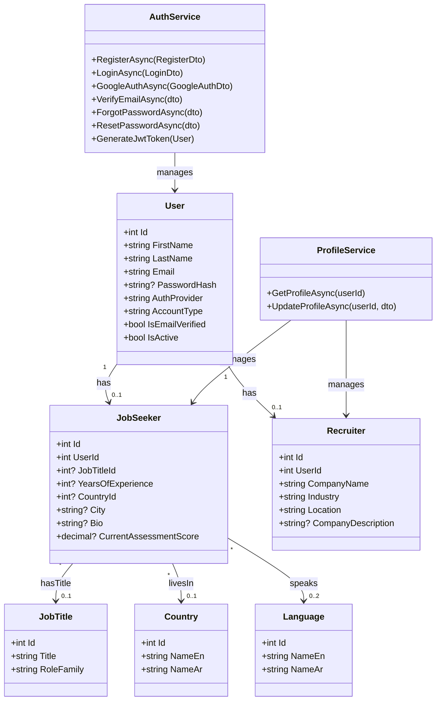

---

### Diagram 2: JobSeeker Profile Module

This diagram shows the job seeker's portfolio components: experience, education, projects, resume, and skills.

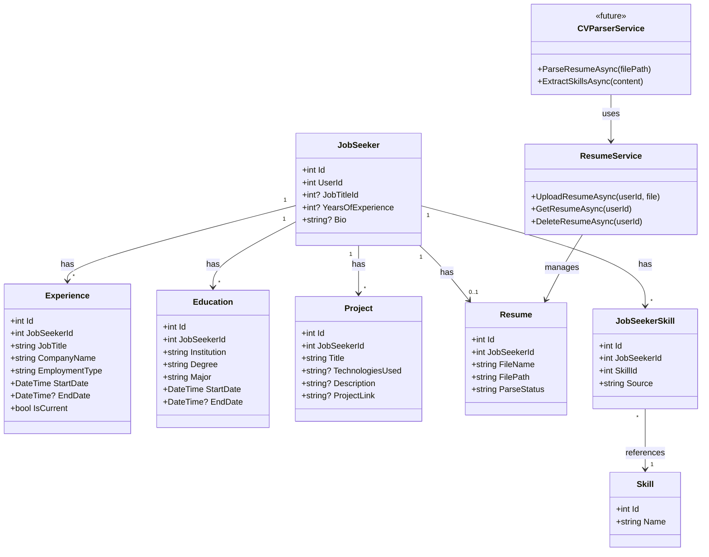

---

### Diagram 3: Assessment Module

This diagram shows the skill verification system through dynamic quizzes.

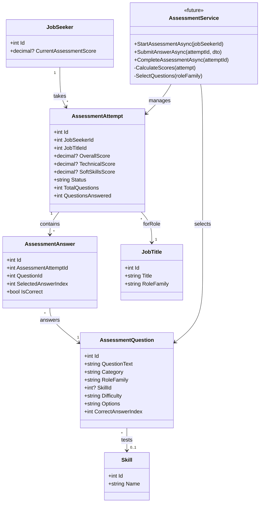

---

### Diagram 4: Job Posting & Candidate Matching Module

This diagram shows the recruiter-driven matching flow:
- **Job Seekers** complete their profiles (experience, education, CV, projects) and take skill assessments, then wait to be contacted.
- **Recruiters** post jobs and receive AI-ranked candidate recommendations with match scores.
- Recruiters review profiles, compare candidates, and contact selected job seekers via email.

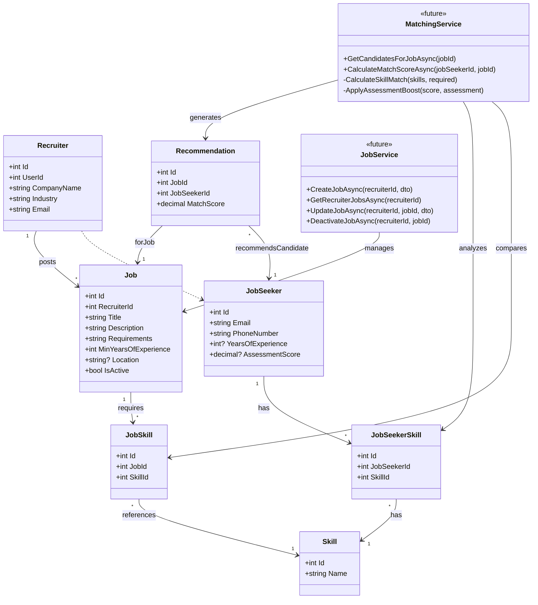

---

## N-Tier Architecture Overview

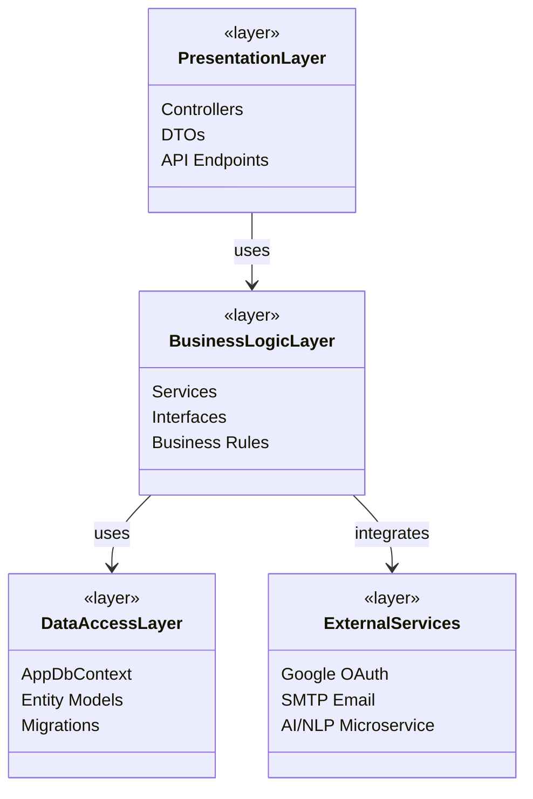

---

## Appendix: Complete System Class Diagram

> **Note:** This comprehensive diagram shows all system components and their relationships. 
> For best viewing, use landscape orientation or view at full scale.

```mermaid
classDiagram
    direction TB

    %% ==================== USER & IDENTITY ====================
    class User {
        +int Id
        +string FirstName
        +string LastName
        +string Email
        +string? PasswordHash
        +string AuthProvider
        +string AccountType
        +bool IsEmailVerified
        +bool IsActive
    }

    class JobSeeker {
        +int Id
        +int UserId
        +int? JobTitleId
        +int? YearsOfExperience
        +int? CountryId
        +string? City
        +string? PhoneNumber
        +string? Bio
        +decimal? CurrentAssessmentScore
    }

    class Recruiter {
        +int Id
        +int UserId
        +string CompanyName
        +string Industry
        +string Location
        +string? CompanyDescription
    }

    %% ==================== JOBSEEKER PROFILE ====================
    class Experience {
        +int Id
        +int JobSeekerId
        +string JobTitle
        +string CompanyName
        +string EmploymentType
        +DateTime StartDate
        +DateTime? EndDate
        +bool IsCurrent
    }

    class Education {
        +int Id
        +int JobSeekerId
        +string Institution
        +string Degree
        +string Major
        +DateTime StartDate
        +DateTime? EndDate
    }

    class Project {
        +int Id
        +int JobSeekerId
        +string Title
        +string? TechnologiesUsed
        +string? Description
        +string? ProjectLink
    }

    class Resume {
        +int Id
        +int JobSeekerId
        +string FileName
        +string FilePath
        +string ParseStatus
    }

    class JobSeekerSkill {
        +int Id
        +int JobSeekerId
        +int SkillId
        +string Source
    }

    %% ==================== ASSESSMENT ====================
    class AssessmentAttempt {
        +int Id
        +int JobSeekerId
        +int JobTitleId
        +decimal? OverallScore
        +decimal? TechnicalScore
        +decimal? SoftSkillsScore
        +string Status
        +int TotalQuestions
        +int QuestionsAnswered
    }

    class AssessmentQuestion {
        +int Id
        +string QuestionText
        +string Category
        +string RoleFamily
        +int? SkillId
        +string Difficulty
        +string Options
        +int CorrectAnswerIndex
    }

    class AssessmentAnswer {
        +int Id
        +int AssessmentAttemptId
        +int QuestionId
        +int SelectedAnswerIndex
        +bool IsCorrect
    }

    %% ==================== JOB & MATCHING ====================
    class Job {
        +int Id
        +int RecruiterId
        +string Title
        +string Description
        +string Requirements
        +int MinYearsOfExperience
        +string? Location
        +bool IsActive
    }

    class JobSkill {
        +int Id
        +int JobId
        +int SkillId
    }

    class Recommendation {
        +int Id
        +int JobId
        +int JobSeekerId
        +decimal MatchScore
    }

    %% ==================== REFERENCE DATA ====================
    class Skill {
        +int Id
        +string Name
    }

    class JobTitle {
        +int Id
        +string Title
        +string RoleFamily
    }

    class Country {
        +int Id
        +string NameEn
        +string NameAr
    }

    class Language {
        +int Id
        +string NameEn
        +string NameAr
    }

    %% ==================== SERVICES ====================
    class AuthService {
        +RegisterAsync(RegisterDto)
        +LoginAsync(LoginDto)
        +GoogleAuthAsync(GoogleAuthDto)
        +VerifyEmailAsync(dto)
        +ForgotPasswordAsync(dto)
        +ResetPasswordAsync(dto)
        +GenerateJwtToken(User)
    }

    class ProfileService {
        +GetProfileAsync(userId)
        +UpdateProfileAsync(userId, dto)
    }

    class ResumeService {
        +UploadResumeAsync(userId, file)
        +GetResumeAsync(userId)
        +DeleteResumeAsync(userId)
    }

    class AssessmentService {
        <<future>>
        +StartAssessmentAsync(jobSeekerId)
        +SubmitAnswerAsync(attemptId, dto)
        +CompleteAssessmentAsync(attemptId)
        -CalculateScores(attempt)
        -SelectQuestions(roleFamily)
    }

    class MatchingService {
        <<future>>
        +GenerateRecommendationsAsync(jobId)
        +GetJobRecommendationsAsync(jobSeekerId)
        +CalculateMatchScoreAsync(jobSeekerId, jobId)
        -CalculateSkillMatch(skills, required)
        -ApplyAssessmentBoost(score, assessment)
    }

    class JobService {
        <<future>>
        +CreateJobAsync(recruiterId, dto)
        +GetRecruiterJobsAsync(recruiterId)
        +SearchJobsAsync(searchDto)
    }

    class CVParserService {
        <<future>>
        +ParseResumeAsync(filePath)
        +ExtractSkillsAsync(content)
    }

    %% ==================== DATA ACCESS ====================
    class AppDbContext {
        +DbSet Users
        +DbSet JobSeekers
        +DbSet Recruiters
        +DbSet Experiences
        +DbSet Educations
        +DbSet Projects
        +DbSet Resumes
        +DbSet JobSeekerSkills
        +DbSet AssessmentAttempts
        +DbSet AssessmentQuestions
        +DbSet Jobs
        +DbSet Recommendations
        +DbSet Skills
        +DbSet JobTitles
    }

    %% ==================== ENTITY RELATIONSHIPS ====================
    User "1" --> "0..1" JobSeeker : has
    User "1" --> "0..1" Recruiter : has

    JobSeeker "1" --> "*" Experience : has
    JobSeeker "1" --> "*" Education : has
    JobSeeker "1" --> "*" Project : has
    JobSeeker "1" --> "0..1" Resume : has
    JobSeeker "1" --> "*" JobSeekerSkill : has
    JobSeeker "1" --> "*" AssessmentAttempt : takes
    JobSeeker "*" --> "0..1" JobTitle : hasTitle
    JobSeeker "*" --> "0..1" Country : livesIn
    JobSeeker "*" --> "0..2" Language : speaks

    Recruiter "1" --> "*" Job : posts

    JobSeekerSkill "*" --> "1" Skill : references
    JobSkill "*" --> "1" Skill : requires
    Job "1" --> "*" JobSkill : requires

    AssessmentAttempt "1" --> "*" AssessmentAnswer : contains
    AssessmentAttempt "*" --> "1" JobTitle : forRole
    AssessmentAnswer "*" --> "1" AssessmentQuestion : answers
    AssessmentQuestion "*" --> "0..1" Skill : tests

    Recommendation "*" --> "1" Job : recommends
    Recommendation "*" --> "1" JobSeeker : to

    %% ==================== SERVICE DEPENDENCIES ====================
    AuthService --> AppDbContext
    ProfileService --> AppDbContext
    ResumeService --> AppDbContext
    AssessmentService --> AppDbContext
    MatchingService --> AppDbContext
    JobService --> AppDbContext
    CVParserService --> ResumeService
```

---

## Sequence Diagrams

Key system workflows illustrated with simplified sequence diagrams.

---

### 1. User Registration

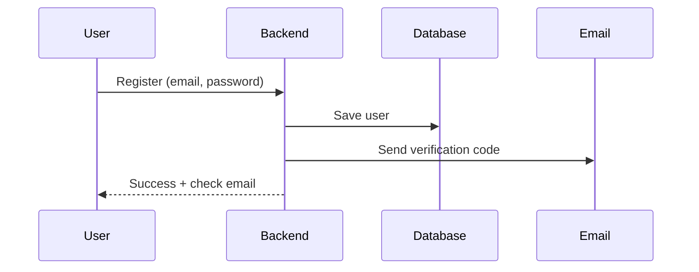

---

### 2. User Login

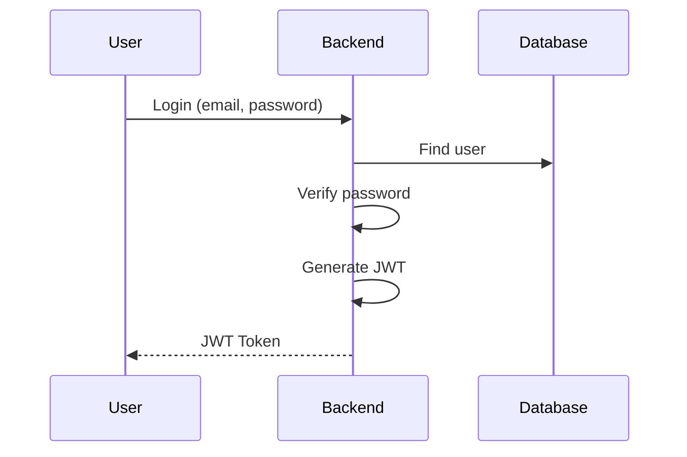

---

### 3. Google OAuth

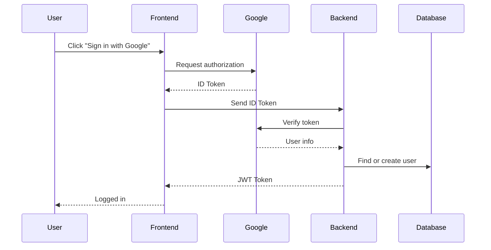

---

### 4. Password Reset

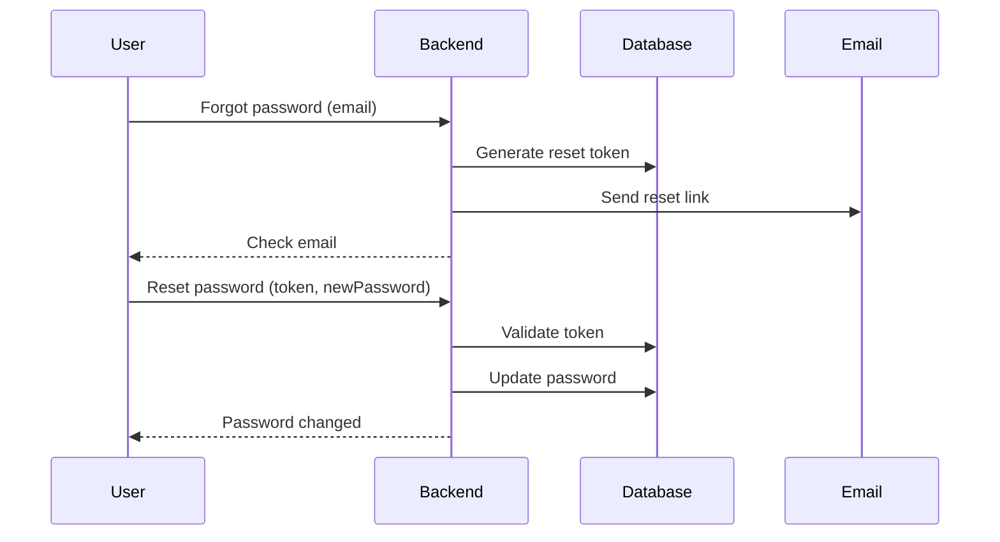

---

### 5. Profile Management

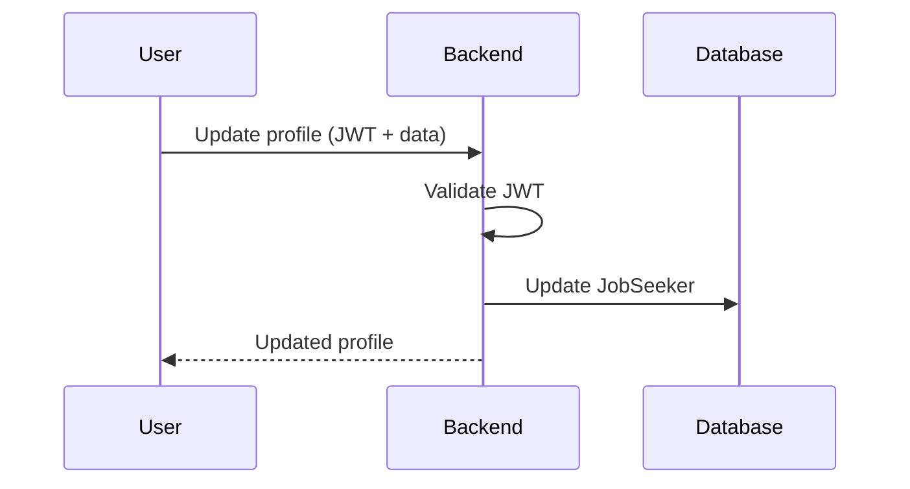

---

### 6. Resume Upload & Parsing

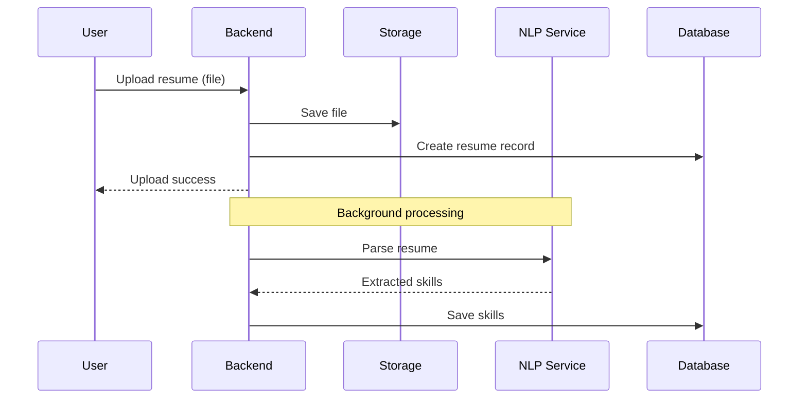

---

### 7. Assessment Quiz

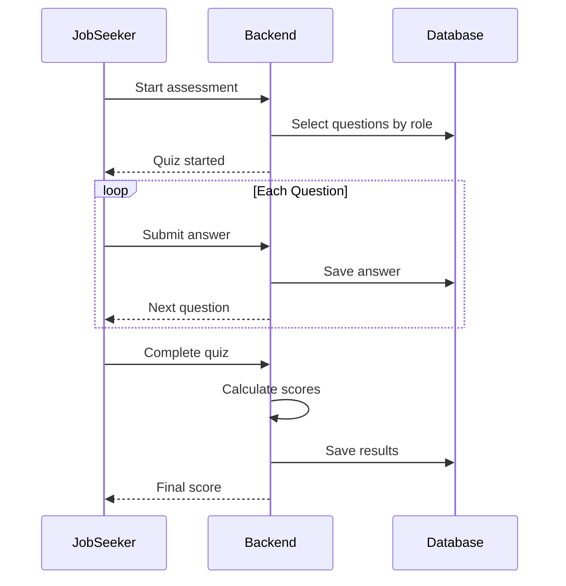

---

### 8. AI Candidate Matching (Recruiter Flow)

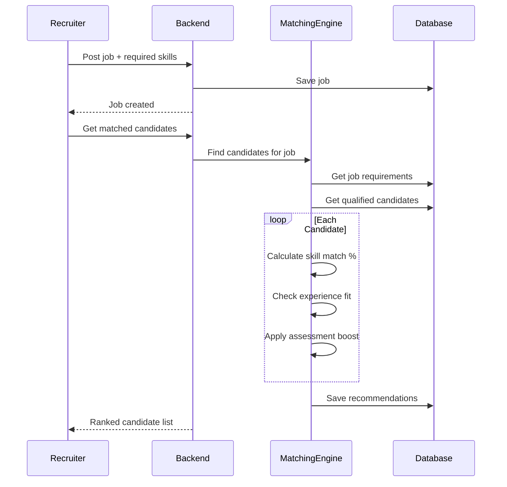

---

### 9. Recruiter Reviews & Contacts Candidates

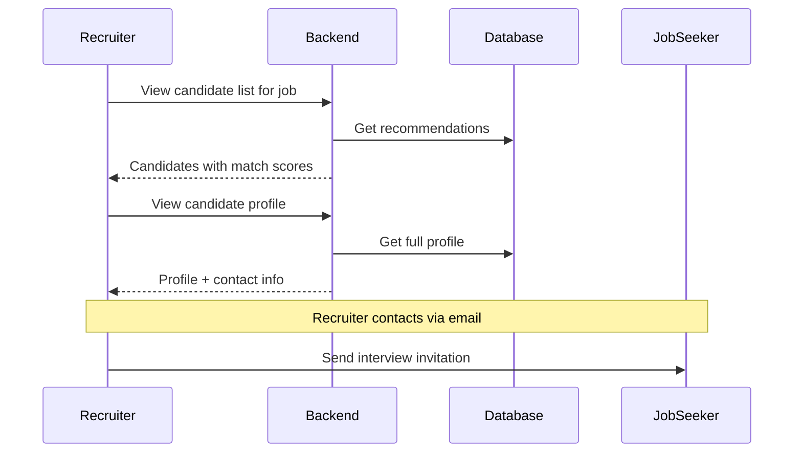

---

### AI Matching Algorithm (For Recruiters)

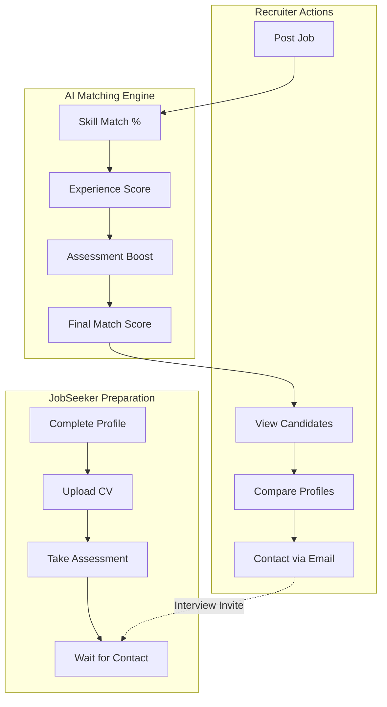

---

## Notes

### Implemented Components ✅
- **Identity Module**: User, EmailVerification, PasswordReset
- **JobSeeker Module**: JobSeeker, Experience, Education, Project, Resume, SocialAccount, JobSeekerSkill
- **Assessment Module**: AssessmentAttempt, AssessmentQuestion, AssessmentAnswer
- **Reference Data**: Skill, JobTitle, Country, Language, Job, JobSkill, Recommendation
- **Services**: Auth, Email, Token, Profile, Resume, Experience, Education, Project, SocialAccount
- **Controllers**: Auth, Profile, Resume, Experience, Education, Projects, SocialAccounts, Locations

### Future/Predicted Components 🔮
- **AssessmentService/Controller**: Full assessment quiz flow
- **JobService/Controller**: Job posting CRUD for recruiters
- **MatchingService**: AI-powered candidate recommendations for recruiters
- **CVParserService**: NLP integration for resume parsing
- **CandidateController**: Endpoints for recruiters to view matched candidates

### Platform Flow Summary
1. **Job Seekers**: Complete profile → Upload CV → Take assessment → Wait for recruiter contact
2. **Recruiters**: Post job → View AI-ranked candidates → Compare profiles → Contact via email → Schedule interview

### Design Patterns Used
- **Repository Pattern**: Via Entity Framework DbContext
- **Dependency Injection**: All services injected via interfaces
- **DTO Pattern**: Data transfer objects for API communication
- **Soft Delete**: IsDeleted flags on Experience, Education, Project, Resume
