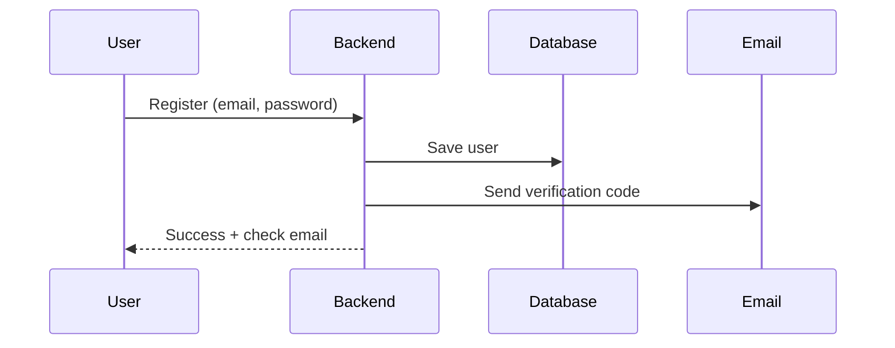
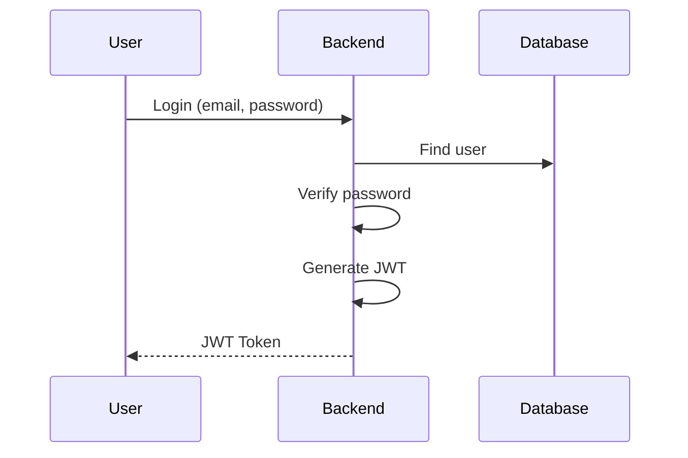
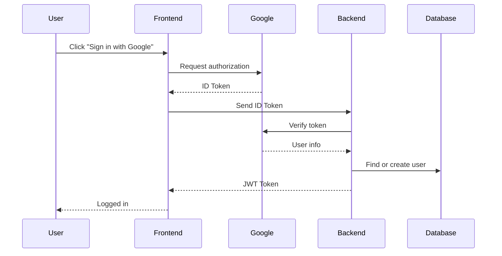
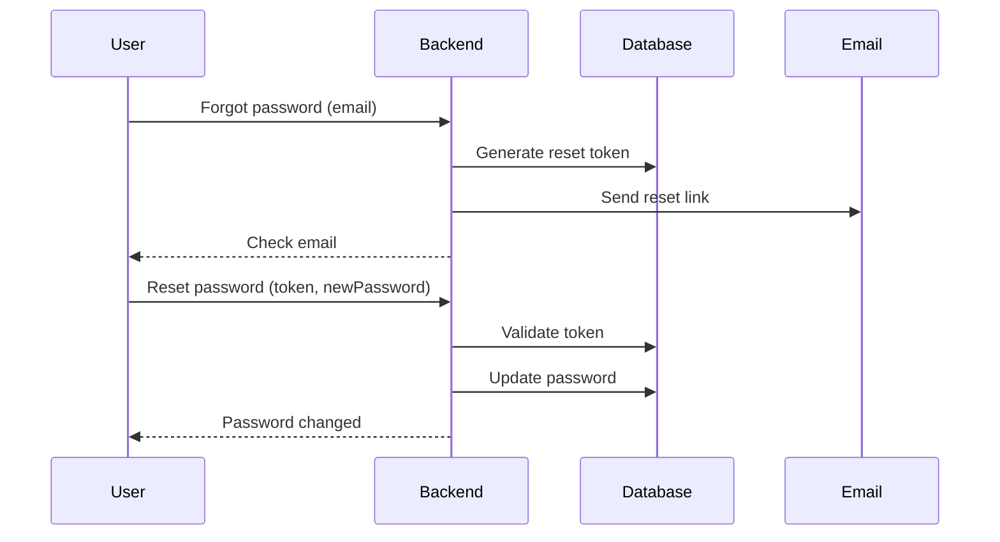
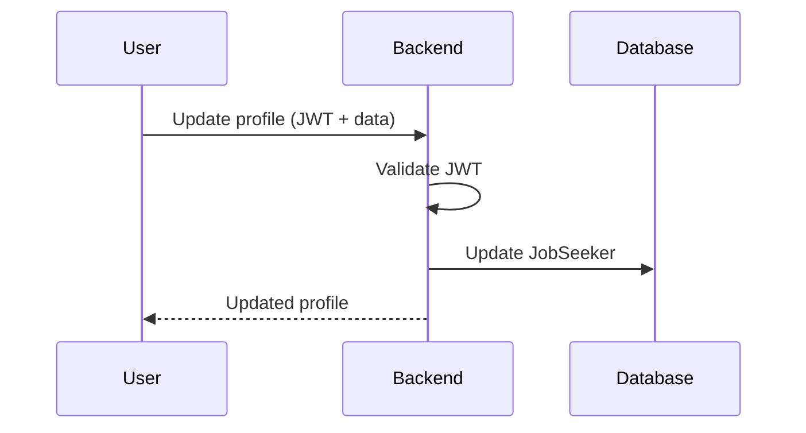
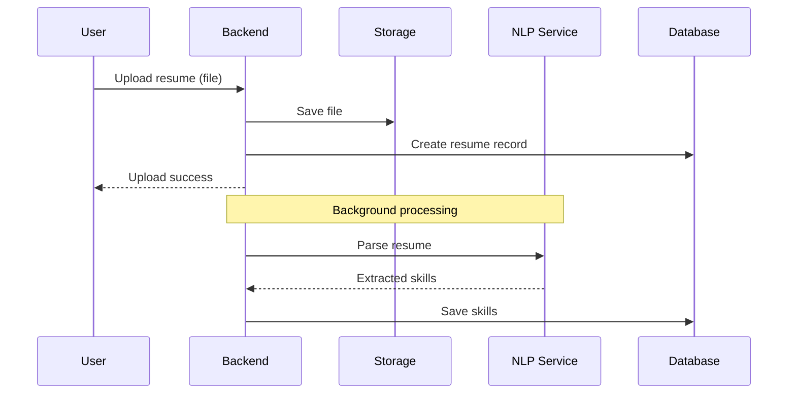
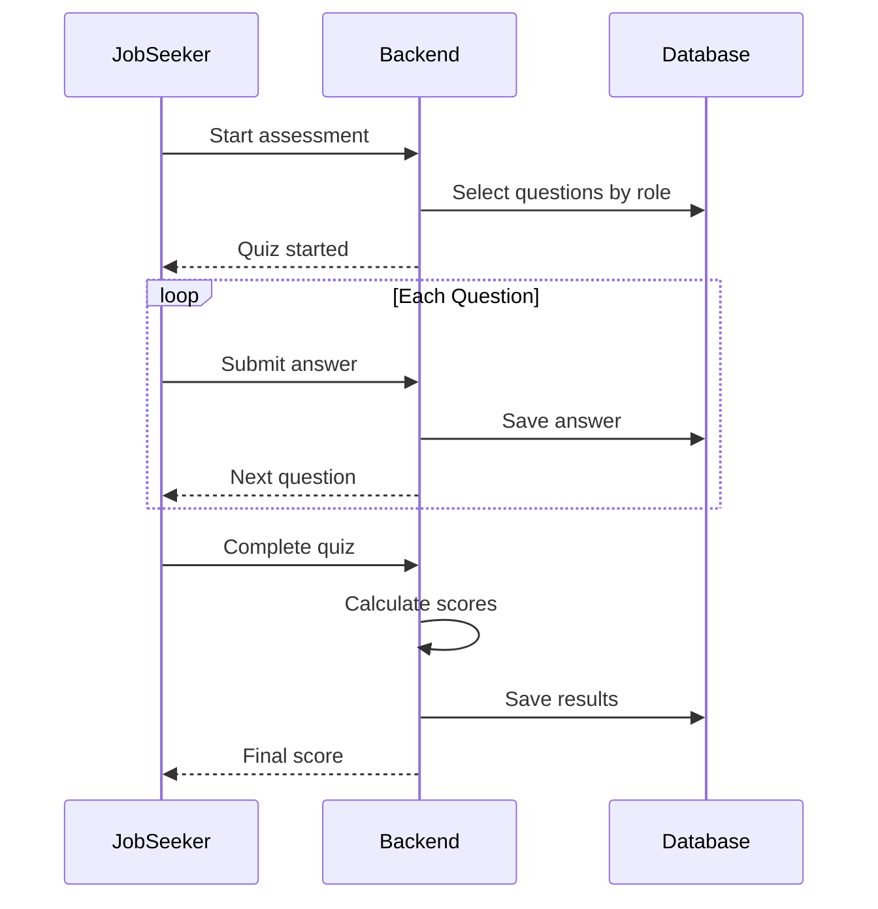
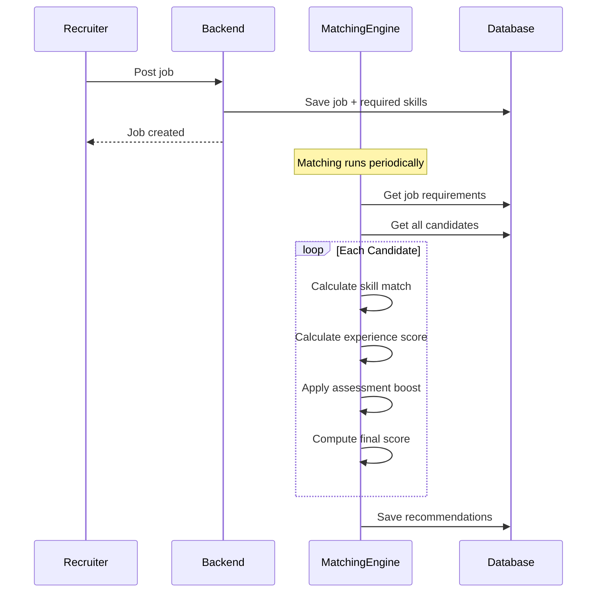
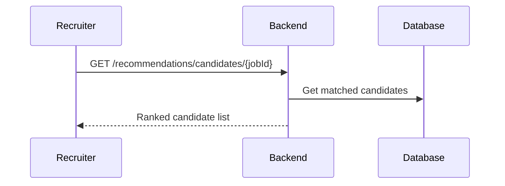
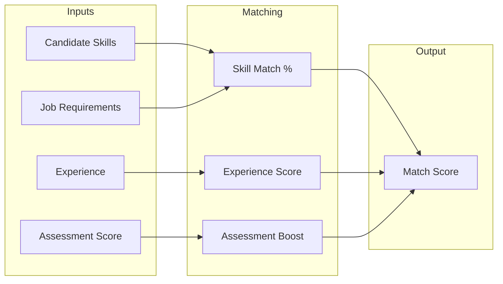

## Sequence Diagrams

Key system workflows illustrated with simplified sequence diagrams.

---

### 1. User Registration

---

### 2. User Login

---

### 3. Google OAuth

---

### 4. Password Reset

---

### 5. Profile Management

---

### 6. Resume Upload & Parsing

---

### 7. Assessment Quiz

---

### 8. AI Job Matching

---

### 9. Get Recommendations

---

### AI Matching Algorithm

---
